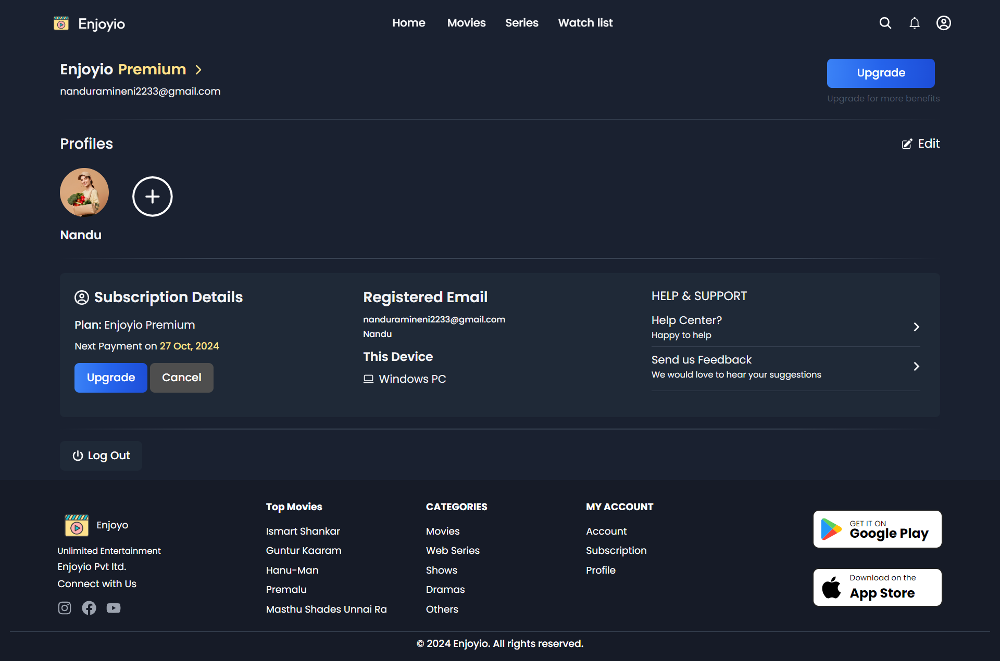
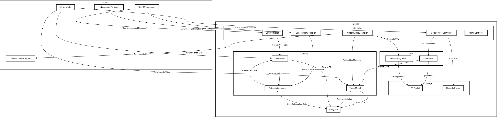

---

# 🎬 Streaming Application

Welcome to the **Streaming Application** repository! This project is built with the MERN stack and leverages AWS services for cloud storage and content delivery. It offers a comprehensive solution for video streaming, user management, subscriptions, and more.

## 📖 Table of Contents
- [Features](#features)
- [Tech Stack](#tech-stack)
- [Installation](#installation)
- [Usage](#usage)
- [API Endpoints](#api-endpoints)
- [License](#license)
- 




## 🌟 Features

- 👤 **User Management**: Sign up, login, and profile management with Firebase authentication and secure JWT tokens.
- 📦 **Subscription Plans**: Users can subscribe to various plans and manage their subscriptions.
- 🎥 **Video Streaming**: Smooth and efficient video streaming experience.
- 🛠️ **Admin Panel**: Admins can manage content, users, and subscriptions.
- 🔔 **Notifications**: Real-time notifications for users.
- 💳 **Payment Integration**: Seamless payment experience with Razorpay, with the ability to receive invoices after payments.
- 📱 **Responsive Design**: Optimized for all devices.
- 🌐 **Cloud Integration**: Using AWS S3 for secure and scalable storage and AWS CloudFront for fast content delivery.

## 🛠 Tech Stack

- **Frontend**: React.js
- **Backend**: Node.js, Express.js
- **Database**: MongoDB
- **State Management**: Redux
- **Authentication**: Firebase, JWT (JSON Web Tokens)
- **Payment**: Razorpay
- **Cloud Storage**: AWS S3
- **Content Delivery Network**: AWS CloudFront

## 🛠 Installation

### Prerequisites

- Node.js and npm installed
- MongoDB installed and running
- Firebase project setup
- AWS S3 bucket and CloudFront distribution setup
- Razorpay account for payment integration

### Steps

1. **Clone the Repository**

```bash
git clone https://github.com/Nandu-ramineni/Streaming-Application.git
cd streaming-application
```

2. **Install Dependencies**

```bash
# Install server dependencies
cd backend
npm install

# Install client dependencies
cd client
npm install

#Install admin dependencies
cd admin
npm install
```

3. **Environment Variables**

Create a `.env` file in the `backend` directory and add the following environment variables:

```env
MONGO_URI=your_mongodb_uri
JWT_SECRET=your_jwt_secret
FIREBASE_API_KEY=your_firebase_api_key
FIREBASE_AUTH_DOMAIN=your_firebase_auth_domain
FIREBASE_PROJECT_ID=your_firebase_project_id
FIREBASE_STORAGE_BUCKET=your_firebase_storage_bucket
FIREBASE_MESSAGING_SENDER_ID=your_firebase_messaging_sender_id
FIREBASE_APP_ID=your_firebase_app_id
RAZORPAY_KEY_ID=your_razorpay_key_id
RAZORPAY_KEY_SECRET=your_razorpay_key_secret
AWS_ACCESS_KEY_ID=your_aws_access_key_id
AWS_SECRET_ACCESS_KEY=your_aws_secret_access_key
S3_BUCKET_NAME=your_s3_bucket_name
CLOUDFRONT_DISTRIBUTION_ID=your_cloudfront_distribution_id
```

4. **Run the Application**

```bash
# Run backend
cd backend
npm run dev

# Run client
cd client
npm run dev

# Run admin
cd admin
npm run dev
```

The backend will run on `http://localhost:7000` and the frontend will run on `http://localhost:5173`.

## 🚀 Usage


### Admin Settings

To access the admin settings, navigate to `/admin/settings`. Admins can manage site settings, notifications, and user management from here.

### Maintenance Mode

To enable maintenance mode, toggle the `Maintenance Mode` setting in the admin panel. When enabled, users will see a maintenance page and will not be able to access other parts of the site.

## 📚 API Endpoints

### Authentication

- **POST** `/user/register`: User signup
- **POST** `/user/login`: User login
- **POST** `/user/logout`: User logout

### User Management

- **GET** `/user/get`: Get all users (admin only)
- **GET** `/user/get/:id`: Get user by ID
- **PUT** `users/update/:id`: Update user by ID
- **DELETE** `/users/delete:id`: Delete user by ID (admin only)

### Subscriptions

- **GET** `/subscription/get`: Get all subscriptions
- **POST** `/subscription/buy`: Create a new subscription
- **PUT** `/subscription/update/:id`: Update subscription by ID
- **DELETE** `/subscription/delete/:id`: Delete subscription by ID

### Payments

- **POST** `/payments/`: Create a Razorpay payment order
- **POST** `/payments/validate`: Verify Razorpay payment

### Videos

- **GET** `/video/stream`: Get all videos
- **GET** `/video/stream/:id`: Get video by ID
- **POST** `/video/upload`: Upload a new video (admin only)
- **PUT** `/video/upload/:id`: Update video by ID (admin only)
- **DELETE** `/video/delete/:id`: Delete video by ID (admin only)

## 📜 License

This project is licensed under the MIT License. See the [LICENSE](LICENSE) file for details.

---

Feel free to reach out if you have any questions or feedback @Nandu-ramineni or nanduramineni2233@gmail.com. Happy coding!

---

Would you like any further adjustments or additional details included?